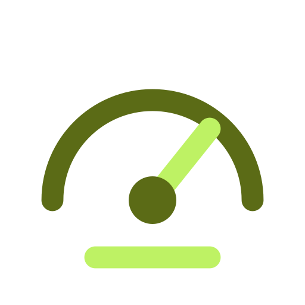

<!-- SPDX-FileCopyrightText: Vernum Projecten B.V. -->
<!-- SPDX-License-Identifier: BUSL-1.1 -->
#  FerroSYS

The control plane of the FerroHEALTH family, in pure Rust: how it all runs.

The control plane touches no clinical content and carries what every server would otherwise invent for itself: liveness and readiness across the deployment, telemetry, the event log, notification subscriptions, and how the whole family is installed, configured and deployed. Every server reports to it and is configured from it.

FerroSYS is one of the [FerroHEALTH](https://ferrohealth.eu/) family. The family
page shows where it sits among the eight and what calls what, and this
repository is where the design and the build happen; the tracker is the
record of both. Its site will be <https://ferrosys.eu/>.

## Licence

FerroSYS is source-available under the Business Source License 1.1. The
parameters that apply, the Licensor, the Licensed Work, the Additional Use
Grant and the Change Date, are in [LICENSE](LICENSE): free for non-commercial
production use, a commercial licence for any other production use, and Apache
2.0 four years after each version is published. The maintainer named in
[MAINTAINERS.md](MAINTAINERS.md) is the contact for a commercial licence.

The brand assets under `assets/brand/` are part of the Licensed Work.
